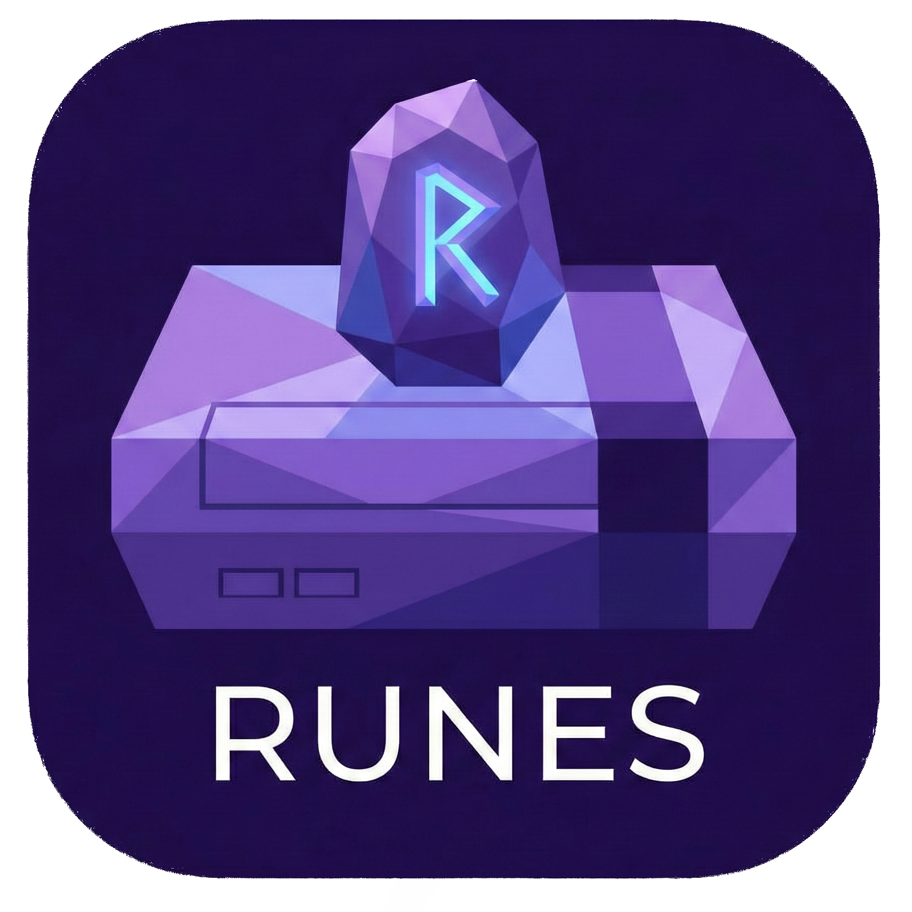
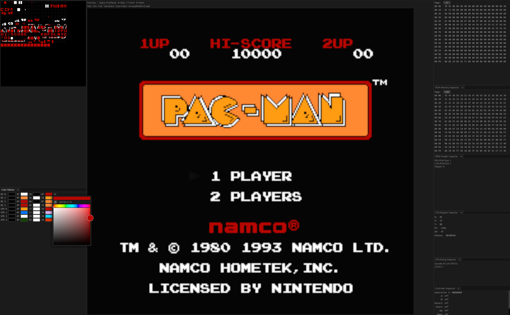

# Runes

> Work in Progress Project

A simple NES emulator written in Rust.

## Running games
- Build and run with a ROM path:
  `cargo run -- path/to/game.nes`

## Current feature being implemented
- Mapper support (bank switching) to move beyond NROM-only cartridges.

## NES features not yet supported
- APU/audio emulation.
- Mapper chips beyond NROM (PRG/CHR banking, mapper IRQs).
- Unofficial 6502 opcodes.
- PPU sprite zero hit and sprite overflow flag behavior.
